

<b> CtradeExchange <i>digital currency, foreign exchange, stock trading , spot matching</i></b>

----

# trade-system
> English | [中文](README_zh.md)

Open source digital currency, foreign exchange, stock trading system, support a variety of trading methods, spot matching, contract full position, contract isolated position, leveraged spot, stock, foreign exchange, etc.

# List of functions:

- Support multiple trading strategies: contract, leverage, spot, and risk hedging (single-shot trading mode)
- Rich open interfaces, convenient and fast access to mainstream payment systems and rapid development of business promotion activities
- Multiple client support (H5, PC, APP), rich market icons, multiple indicators
- Powerful background management, support the main white label mode, and realize the simultaneous development of multiple business modes
- Flexible parameter configuration capabilities, various transaction parameter configurations take effect in real time
- Stable market structure, supporting mutual backup of multiple sources (coinapi, binance, ib, ig, longbridge, etc.)

# Features:
- Client
<table>
  <tr>
     <td>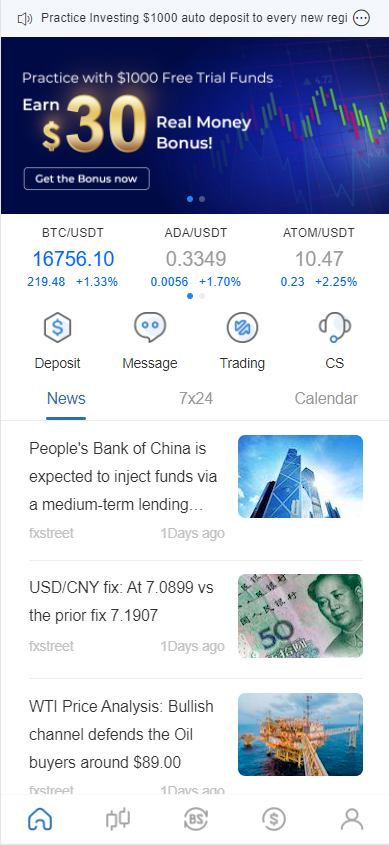</td>
     <td>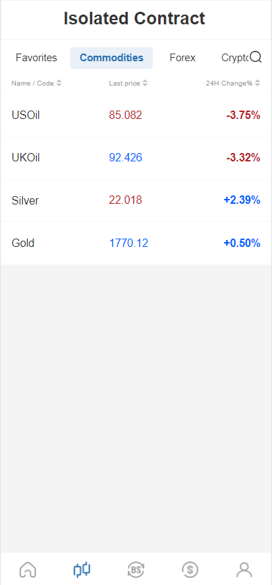</td>
	 <td>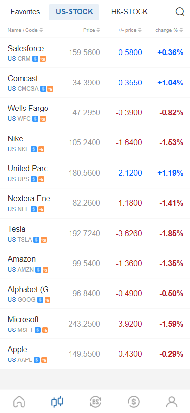</td>
     <td>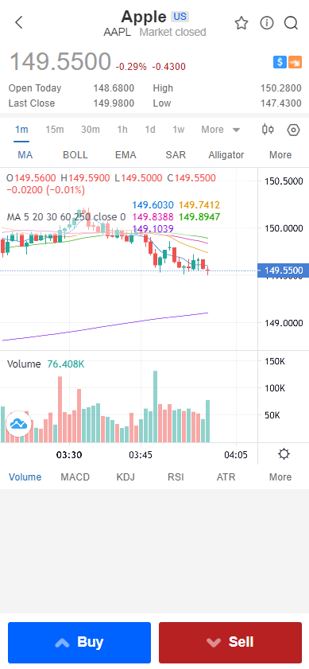</td>
  </tr>
  <tr>
     <td>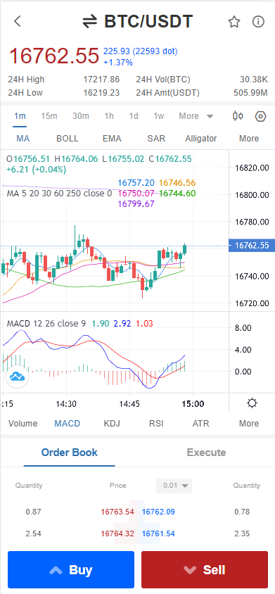</td>
     <td>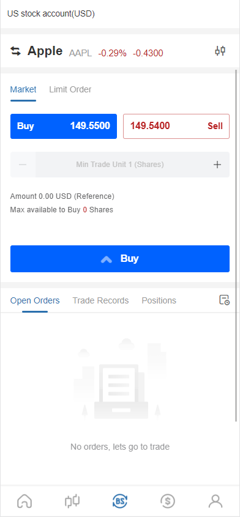</td>
	 <td>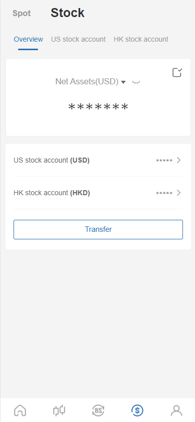</td>
     <td>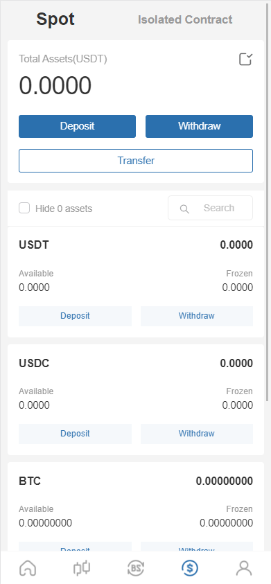</td>
  </tr>
  <tr>
     <td>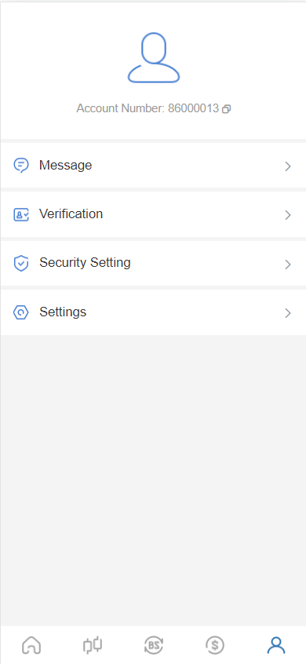</td>
     <td></td>
	 <td></td>
     <td></td>
  </tr>
</table>

- Management background

<table>
  <tr>
     <td>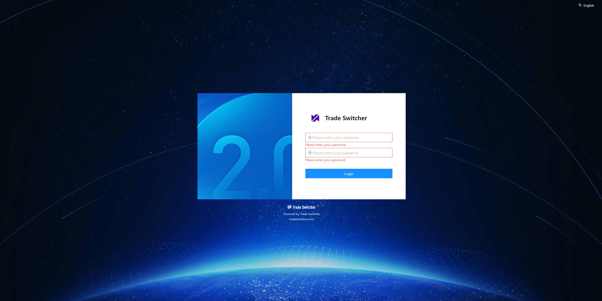</td>
     <td>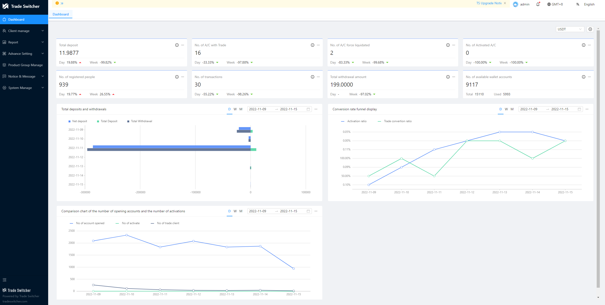</td>
  </tr>
  <tr>
	 <td>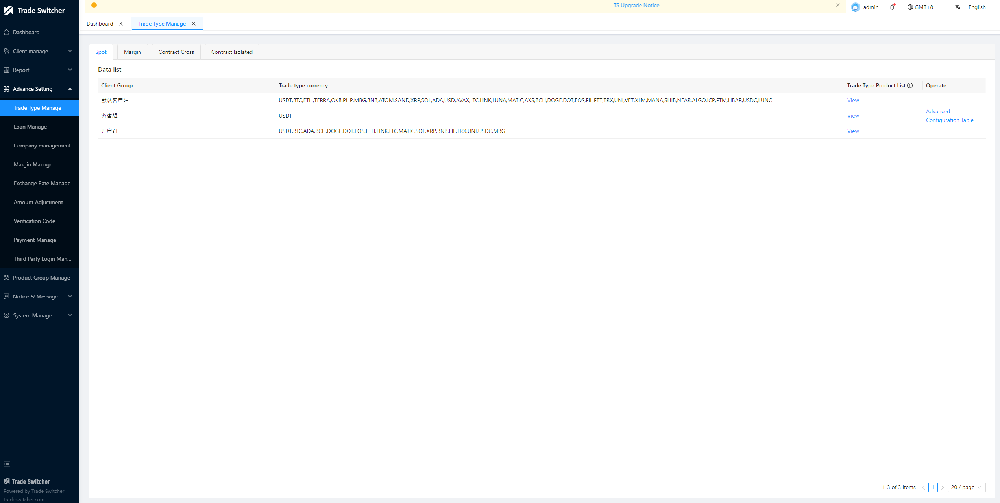</td>
     <td>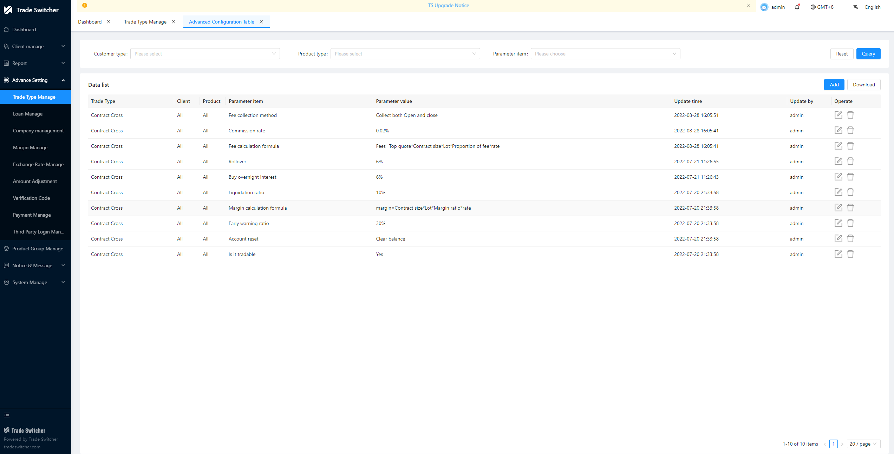</td>
  </tr>
  <tr>
     <td>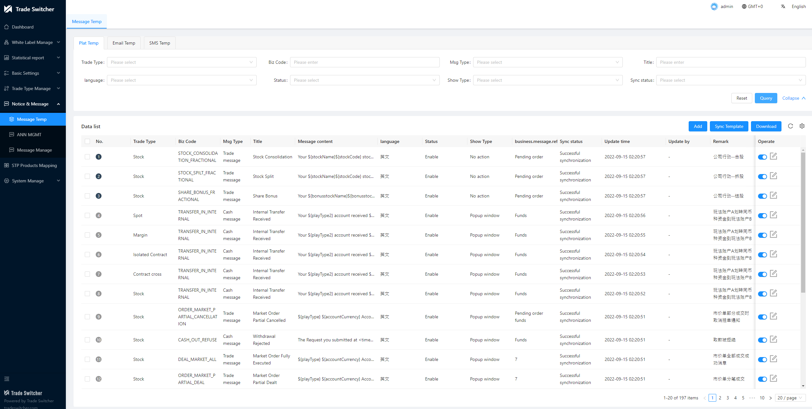</td>
     <td>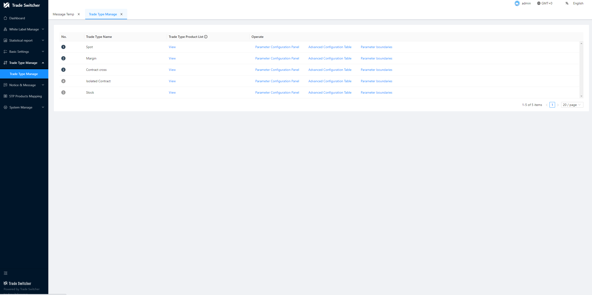</td>
  </tr>
  <tr>
	 <td>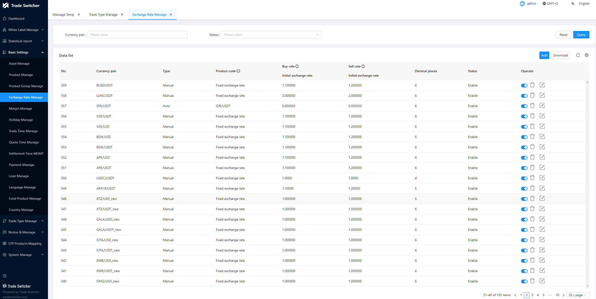</td>
     <td>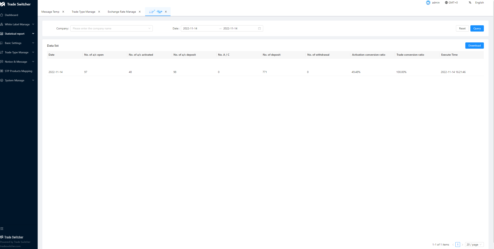</td>
  </tr>
  <tr>
     <td>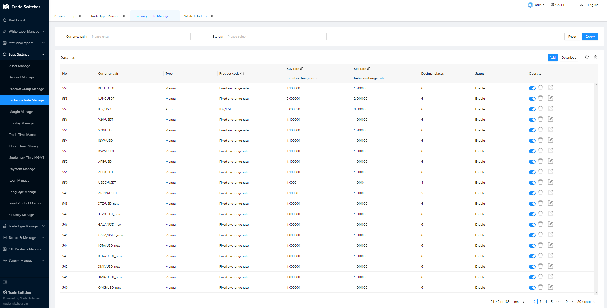</td>
     <td></td>
  </tr>
</table>

# Main technique:

## Backstage:
- Development framework: Spring Boot 2.7
- Microservice Framework: Spring Cloud 2021
- Security framework: Spring Security + Spring OAuth 2.0
- Task scheduling: Quartz, Saturn
- Database support: MySQL, PostgreSQL, MongoDB, TiDB, influxDB
- Persistence layer framework: MyBatis && MyBatis Plus
- Database connection pool: Druid
- Service registration and discovery: Nacos
- Client load balancing: Spring Cloud Loadbalancer
- Fuse component: Sentinel
- Gateway component: Spring Cloud Gateway
- Log management: Logback
- Running container: Undertow
- Distributed transactions: LCN, Seata
- Workflow: Activiti 5.22
- Data synchronization: Canal
- Message middleware: Kafka, RocketMQ
- In-memory database: Ignite
- Matching engine: Exchange-core
- Lock-free queue: LMAX Disruptor
- Risk control rule engine: Drools
- Transaction communication protocol Netty + Dubbo
- Market communication protocol TCP + PB

## front end:
- JS framework: Vue, Avue, nodejs
- CSS framework: sass
- Component library: ElementUI
- Package build tool: Webpack
- Client Uniapp

# Service definition:

  
<b>🕸 Trade Api/Trading Interface</b>

  After receiving the request, perform static risk control and pre-buy orders based on configuration parameters such as product, account, and authority. After the delayed transaction order is sent to PBO successfully, it will be returned to the customer, and the price adjustment order will be bound to the parameters used for settlement after passing the static risk control Put the request in the correct MQ. If it is a read-only query request, directly request clearing.
  

  
<b>🔗PreBuried Order(PBO)/Pre-Buried Order</b>

  Provide an interface to query the user's pending order. If the price or time is triggered, it will request back to the Trade Api to continue at the market price. There is no need to freeze in this module, generate pre-paid orders, maintain order status, and generate delayed transaction orders to maintain order status

  

  
<b>🤖 Trade/Trading Services</b>

  It is processed one by one according to the request order of a single user. There are only market orders here. First, the price risk control of the real-time market is followed, and then the freeze is performed, and the freeze is 20% more (configurable). After the freeze is successful, an order is generated, and the confirmed order is sent to clearing. After clearing is received, it returns to the client successfully. All positions are closed first, and the position is frozen. If the freezing is successful, the client will be returned successfully. When receiving a liquidation request, you need to cancel the prepaid order and delayed order.
  

  
<b>🔎 Order/order service</b>

  Insert a new order, update the order, and provide an order list query interface.
  

  
<b>🧩 Clearing/clearing settlement service</b>

  Execute matching orders, generate positions, provide floating profit and loss interface (real-time calculation), provide account basic information interface (Account), provide account real-time information interface (real-time calculation + Account), deposit and withdrawal request processing (fund management service direct call) , Various types of forced liquidation, overnight interest collection, position change account change notification (to be discussed), fund freezing interface, and position freezing interface.
  

  
<b>💻 Postion/position service</b>

  Insert new position, update position, broadcast position data, position list interface, freeze position interface</a>.
  

  
<b>💡Account/Account Services</b>

  Bookkeeping, reconciliation, account opening, account cancellation, freezing, account basic information interface</a>.
  

  
<b>📊 Real Time Calculate(RTC)/Real Time Calculation Service</b>

  Margin calculation, send orders to CFD Trade for liquidation, take profit and stop loss to close positions, and send orders to CFD Trade, providing floating profit and loss interface
  

  
<b>🗃 Settlement/Product interest settlement service</b>

  When the product expires, send an order to Trade, and when the settlement time arrives, send an order to clearing
  

  
<b>🏘 Config Service/parameter configuration service</b>

  Configure product data, account group data, be responsible for persistence, and provide broadcast synchronization update of configuration information, etc. Other services that need to use configuration information subscribe to this service. The design diagram is in another picture "Basic Data Design Diagram"

  

  
<b>🧠Customer Service/Account Opening KYC Service</b>

  Customer account opening, authorization verification, KYC certification configuration, and KYC data core services; provide KYC certification parameter configuration and customer data review functions; and provide basic customer data query and data export functions.
  

  

  
<b>🔎 Fund Service/Deposit and withdrawal service</b>

  Core services such as customer fund inquiry, recharge and deposit, and withdrawal proposal; responsible for payment gateway access, configuration of different payment methods, and basic payment parameter settings; at the same time, it provides functions such as inquiry of deposit and withdrawal records and data export.
  

  
<b>🧩 Meaasge Service/Message Center Service</b>

  Responsible for the external sending interface of internal messages, SMS, Email and other messages
  

  
<b>💻Admin Service/Platform Management Service</b>

  SAAS background management, users set product permissions and game configuration, SMS, Email, payment and other related basic configuration functions; provide white label companies, and assign white label permission levels; white labels can configure their own product parameters and manage their own customers Data, such as data and transaction processes.
  

# Overall structure:

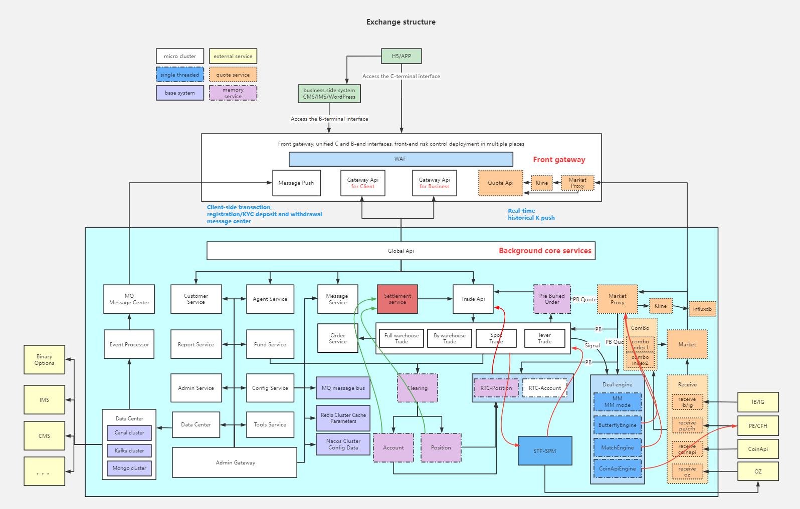

# Core process:
Flow chart, Supplemental English version

## Changelog
Detailed changes for each release are documented in the [release notes](CHANGELOG.md).