

<b> CtradeExchange <i>digital currency, foreign exchange, stock trading , spot matching</i></b>

----

# 交易系统后台
> [English](README.md) | 中文

开源数字货币、外汇、股票交易系统，支持多种交易方式，现货撮合、合约全仓、合约逐仓、杠杆现货、股票、外汇等。

# 功能清单：

- 1、支持多种交易策略：合约、杠杆、现货、以及风险对冲（射单交易模式）
- 2、丰富的开放接口，方便快速接入主流的支付系统和快速开发业务推广活动
- 3、多种客户端支持（H5、PC、APP），丰富的行情图标，多种指标
- 4、强大的后台管理，支持主白标模式，实现多种业务模式同时开展
- 5、灵活的参数配置能力，各种交易参数配置实时生效
- 6、稳定的行情架构，支持多源（coinapi、binance、ib、ig、longbridge等）互备

# 功能介绍：
- 1、客户端
<table>
  <tr>
     <td></td>
     <td>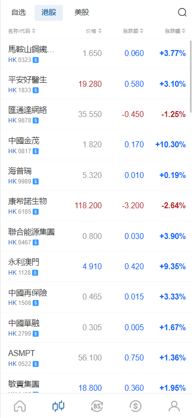</td>
	 <td>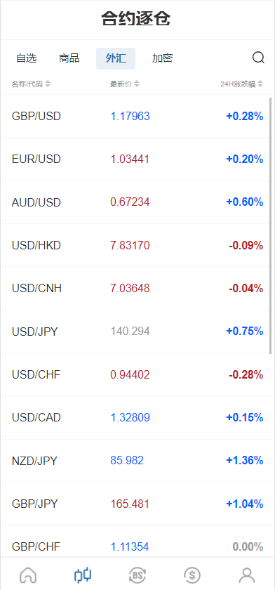</td>
     <td>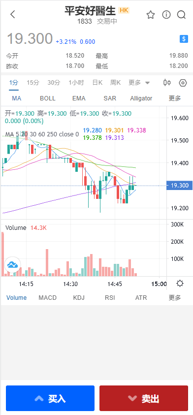</td>
  </tr>
  <tr>
     <td>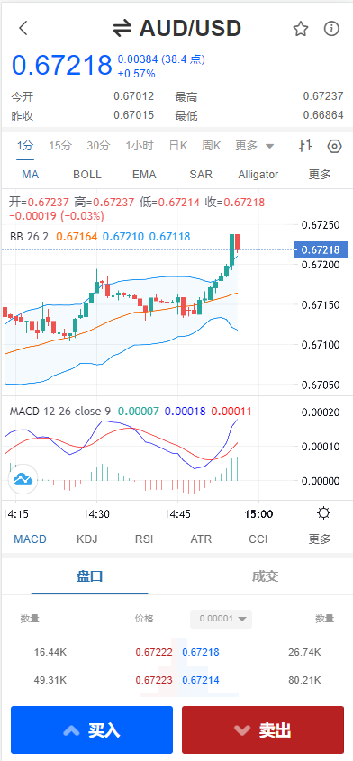</td>
     <td>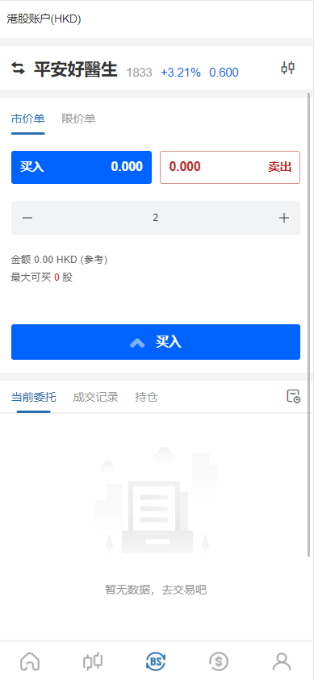</td>
	 <td>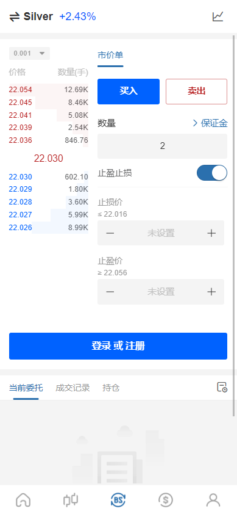</td>
     <td>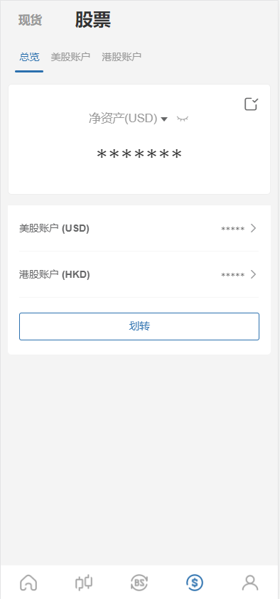</td>
  </tr>
  <tr>
     <td>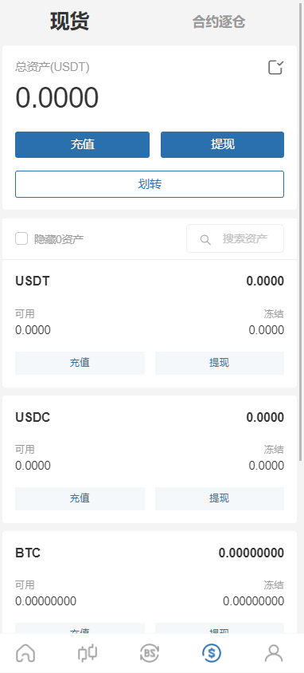</td>
     <td>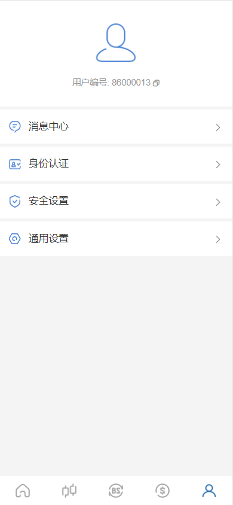</td>
	 <td></td>
     <td></td>
  </tr>
</table>

- 2、管理后台

<table>
  <tr>
     <td>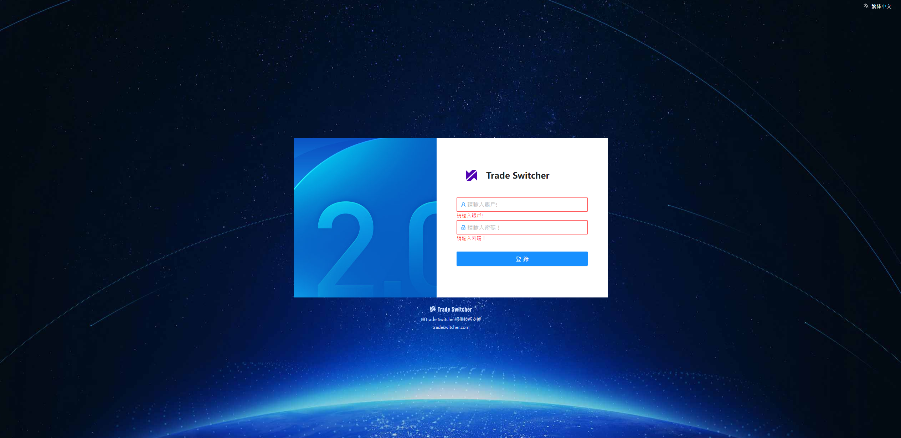</td>
     <td>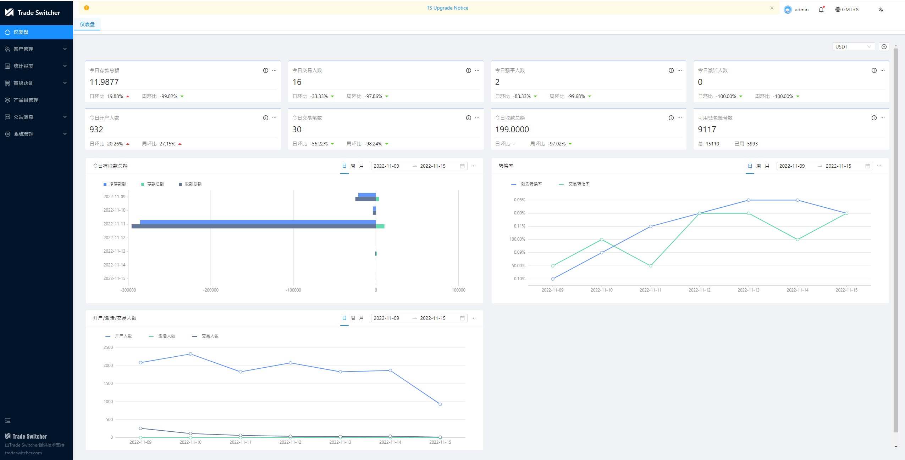</td>
  </tr>
  <tr>
	 <td>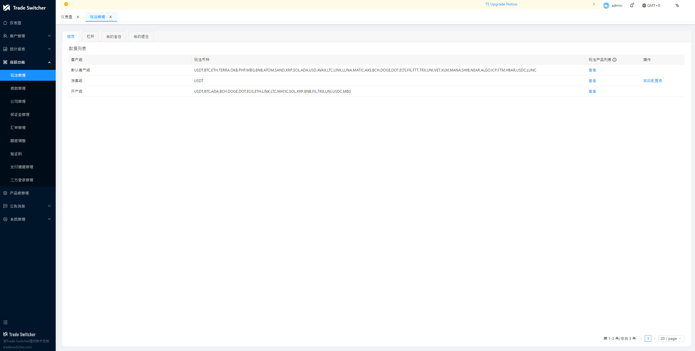</td>
     <td>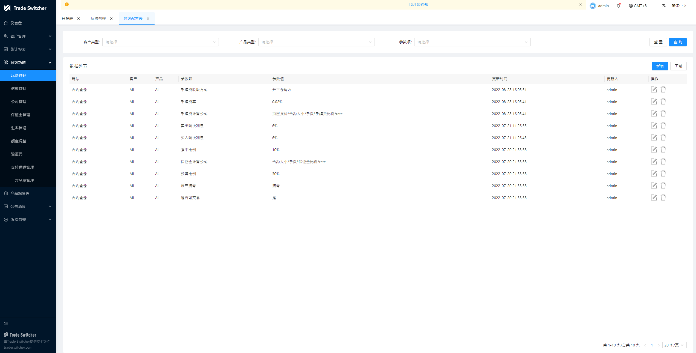</td>
  </tr>
  <tr>
     <td>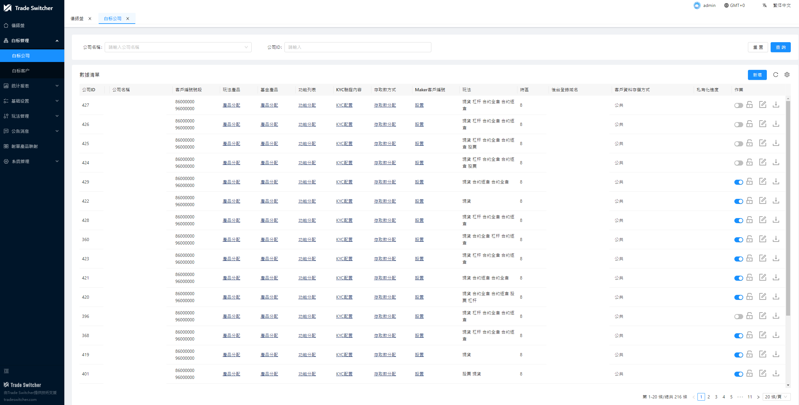</td>
     <td></td>
  </tr>
  <tr>
	 <td>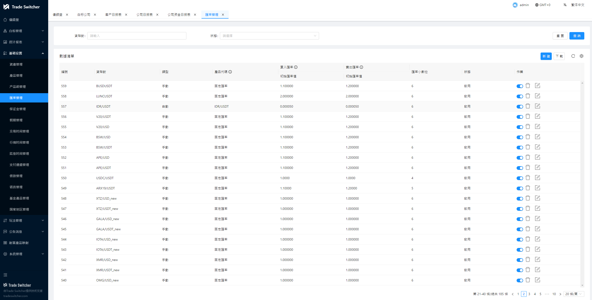</td>
     <td>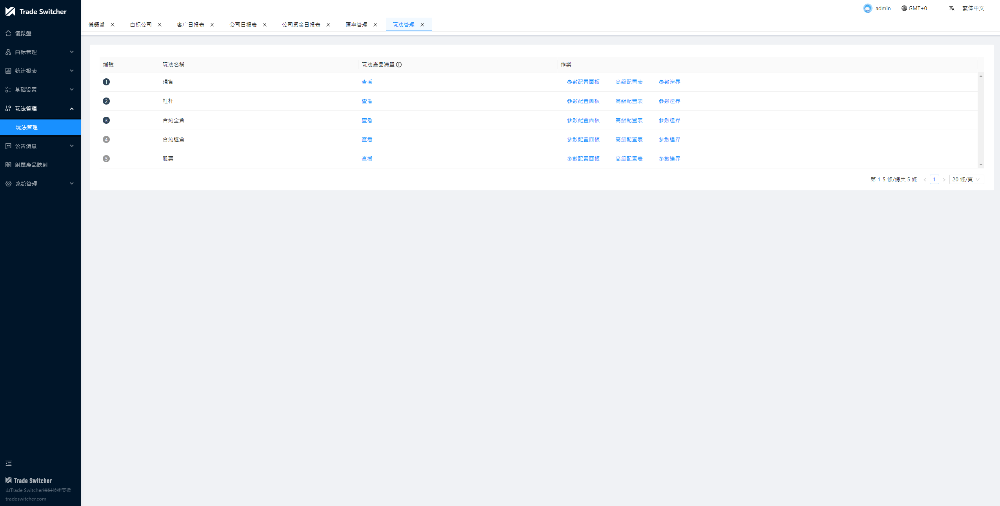</td>
  </tr>
  <tr>
     <td>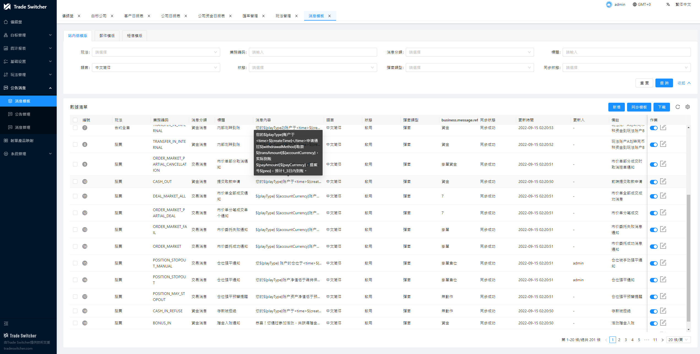</td>
     <td></td>
  </tr>
</table>

# 主要技术：

## 后端：
- 开发框架：Spring Boot 2.7
- 微服务框架：Spring Cloud 2021
- 安全框架：Spring Security + Spring OAuth 2.0
- 任务调度：Quartz 、 Saturn
- 数据库支持: MySQL、PostgreSQL、 MongoDB、 TiDB 、influxDB
- 持久层框架：MyBatis && MyBatis Plus
- 数据库连接池：Druid
- 服务注册与发现: Nacos
- 客户端负载均衡：Spring Cloud Loadbalancer
- 熔断组件：Sentinel
- 网关组件：Spring Cloud Gateway
- 日志管理：Logback
- 运行容器：Undertow
- 分布式事务：LCN、Seata
- 工作流: Activiti 5.22
- 数据同步：Canal
- 消息中间件：Kafka、RocketMQ
- 内存型数据库：Ignite
- 撮合引擎：Exchange-core
- 无锁队列：LMAX Disruptor
- 风控规则引擎：Drools
- 交易通讯协议 Netty + Dubbo
- 行情通讯协议 TCP + PB

## 前端：
- JS 框架：Vue、、Avue、nodejs
- CSS 框架：sass
- 组件库：ElementUI
- 打包构建工具：Webpack
- 客户端 Uniapp

# 服务定义：

  
<b>🕸 Trade Api/交易接口</b>

  收到请求后基于产品，账户，权限等配置参数进行静态风控、预埋单，延时成交单发给PBO成功后返回给客户、调价单通过静态风控后绑定清结算使用的参数之后把请求放到正确的MQ中、如果是只读类查询请求直接请求clearing。
  

  
<b>🔗 PreBuried Order(PBO)/预埋单</b>

  提供查询用户的挂单接口、如果价格或者时间触发则请求回Trade Api按市价继续走，此模块中不需要冻结，生成预埋单订单，维护订单状态，生成延时成交订单维护订单状态

  

  
<b>🤖 Trade/交易服务</b>

  按照单个用户的请求顺序逐个处理，这里只有市价单，先按过实时行情的价格风控，之后执行冻结，多冻结20%(可配)，冻结成功后生成订单，确定的订单发给clearing，clearing收到后返回给客户成功。所有的平仓先冻结仓位，冻结成功返回客户成功。接收到爆仓请求时则需要把预埋单与延时单取消掉。
  

  
<b>🔎 Order/订单服务</b>

  插入新订单，更新order，提供order列表查询接口。
  

  
<b>🧩 Clearing/清结算服务</b>

  执行撮合确定的订单，生成仓位、提供浮动盈亏接口（实时计算）、提供账户基本信息接口（Account）、提供账户实时信息接口（实时计算+Account）、出入金请求处理（资金管理服务直接调用）、各类强平、隔夜利息收取、仓位变更账户变更走消息通知（待讨论）、资金冻结接口、仓位冻结接口。
  

  
<b>💻 Postion/持仓服务</b>

  插入新仓位、更新仓位、广播仓位数据、仓位列表接口、冻结仓位接口</a>。
  

  
<b>💡 Account/账户服务</b>

  记账、对账、开户，销户，冻结、账户基本信息接口</a>。
  

  
<b>📊 Real Time Calculate(RTC)/实时计算服务</b>

  保证金计算，爆仓发指令给CFD Trade、止盈止损平仓发指令给CFD Trade、提供浮动盈亏接口
  

  
<b>🗃 Settlement/产品结息服务</b>

  产品到期强平发指令给Trade、结算时间到发指令给清结算
  

  
<b>🏘 Config Service/参数配置服务</b>

  配置产品数据，账户组数据，负责持久化，负责提供配置信息的广播同步更新等，需要使用配置信息的其它服务订阅该服务，设计图在另一张图中《基础数据设计图》

  

  
<b>🧠 Customer Service/开户KYC服务</b>

  客户开户、授权校验、KYC认证配置、KYC资料核心服务；提供KYC认证参数配置以及客户资料审核功能；同时提供客户资料基础查询以及数据导出等功能。
  

  

  
<b>🔎 Fund Service/出入金服务</b>

  客户资金查询、充值入金、出金提案等核心服务；负责支付网关接入，不同支付方式配置以及基础支付参数设置；同时提供出入金记录查询以及数据导出等功能。
  

  
<b>🧩 Meaasge Service/消息中心服务</b>

  负责站内信、短信、Email等消息对外发送接口
  

  
<b>💻 Admin Service/平台管理服务</b>

  SAAS化后台管理，用户设置产品权限以及玩法配置，短信、Email、支付等相关基础配置功能；提供开白标公司，以及分配白标权限级别；白标可以配置自己的产品参数以及管理自己的客户数据和交易流程等数据。
  

  
  

# 整体架构：

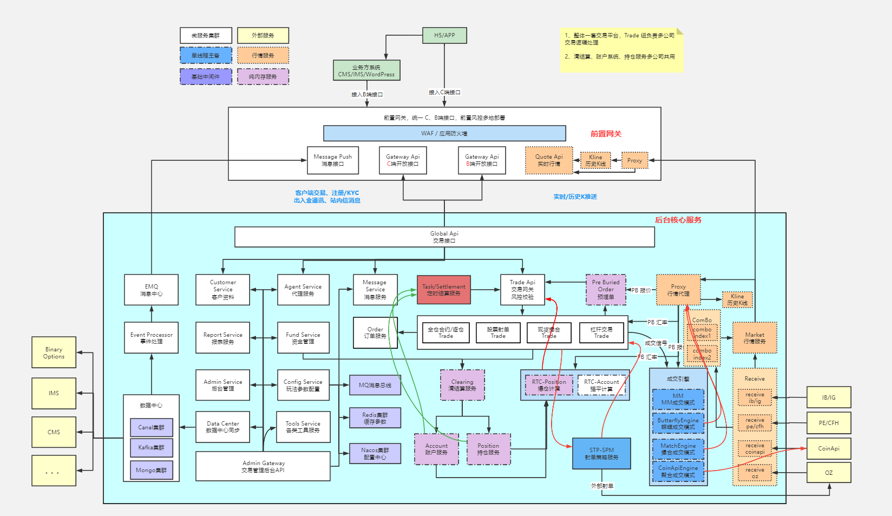

# 核心流程：
流程图，补充英文版本

## 版本日志
每个版本的详细更改记录在 [版本日志](CHANGELOG.md).

